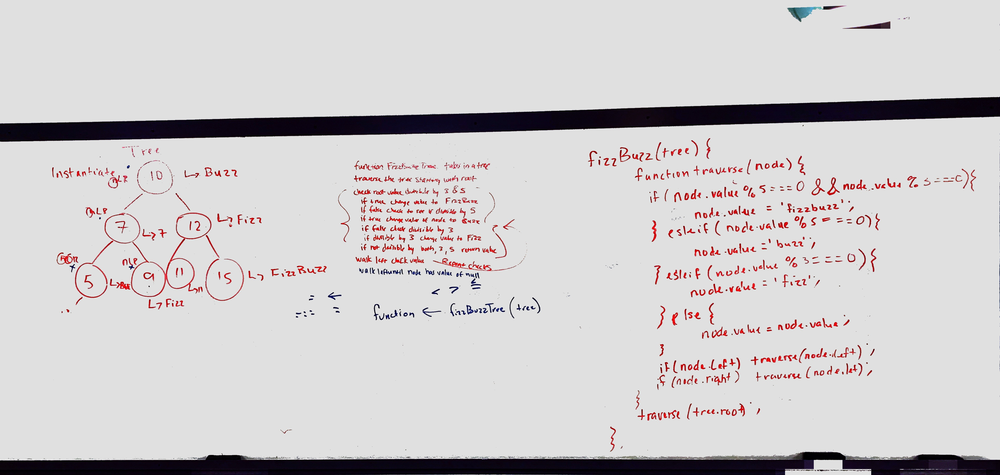
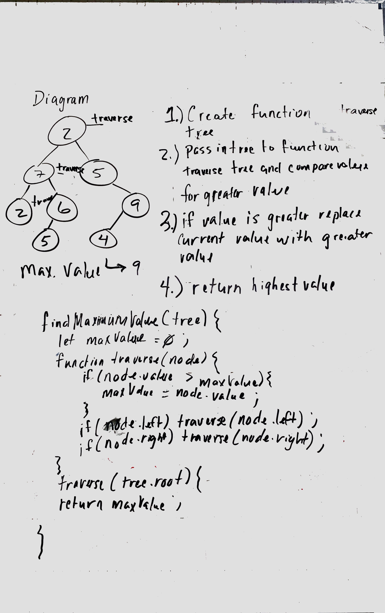

# data-structures-and-algorithms
Javascript 401 Data Structures and Algorithms

# Table of Contents

# Data Structures

# Challenge Summary
Instantiate a Linked List.

## Challenge Description
Create and Instantiate a Linked List with values with using a append method with append values to the end of linked list.
insert method inserts a value at the beginning of a linked list 
includes method traverses a linked list and searches for a given value
toString method converts a values to a string.
insertBefore method will insert a value before a given node. 
insertAfter method will insert a value after a given node.

## Approach & Efficiency
Traversal of Linked list using while loop is O(N). The assignment operators are O(1).

## Solution
[Singly Linked-List](https://github.com/jeremy-401-advanced-javascript/data-structures-and-algorithms/pull/13)

# Challenge Summary
Creat a method that returns a value traversing from the end of linked list.

## Challenge Description
Insert a number into a function it should traverse the linked list and return a value. Starting postion of value should be from the of the linked list counting back towards the beginning. If number exceeds the length of the linked list return undefined.

## Approach & Efficiency
Traversal of Linked list using while loop is O(N). The assignment operators are O(1).

## Solution
[Linked-List From End](https://github.com/jeremy-401-advanced-javascript/data-structures-and-algorithms/pull/13)

# Challenge Summary
Merge two Linked list

## Challenge Description
Merging to Linked List together, instantiating one Linked List from the the both Linked list.

## Approach & Efficiency
Traversal of both linked list using a while loop is O(N). The assignment operators are O(1).

## Solution
[Merge Linked-List](https://github.com/jeremy-401-advanced-javascript/data-structures-and-algorithms/pull/13)

# Challenge Summary
Stacks and Queues

## Challenge Description
<!-- Description of the challenge -->

## Approach & Efficiency
<!-- What approach did you take? Why? What is the Big O space/time for this approach? -->

## Solution
[Stacks-And-Queues](https://github.com/jeremy-401-advanced-javascript/data-structures-and-algorithms/pull/8)

# Challenge Summary
Queue From Stacks

## Challenge Description
<!-- Description of the challenge -->

## Approach & Efficiency
<!-- What approach did you take? Why? What is the Big O space/time for this approach? -->

## Solution
[Stacks-And-Queues](https://github.com/jeremy-401-advanced-javascript/data-structures-and-algorithms/pull/9)

# Challenge Summary
Fifo Animal Shelter

## Challenge Description
<!-- Description of the challenge -->

## Approach & Efficiency
<!-- What approach did you take? Why? What is the Big O space/time for this approach? -->

## Solution
[Fifo Animal Shelter](https://github.com/jeremy-401-advanced-javascript/data-structures-and-algorithms/pull/11)

# Challenge Summary
Tree fizzBuzz

## Challenge Description
Make a method that traverses a tree and returns an evaluation. If the number is divisible by 3 and 5 return fizzbuzz, else if a value is divisible by 5 return buzz, else if a number is divisible by e return fizz, else return the value as is.

## Approach & Efficiency

Traversal of both linked list using a while loop is O(N). The assignment operators are O(1).

## Solution
[fizzBuzz](https://github.com/jeremy-401-advanced-javascript/data-structures-and-algorithms/pull/11)

# Challenge Summary
Tree fizzBuzz

## Challenge Description
Make a method that traverses a tree and compares the node values to determine which value is the greatest value in the node tree.

## Approach & Efficiency

Traversal of both linked list using a while loop is O(N). The assignment operators are O(1).

## Solution
[maxiumTreeValue](https://github.com/jeremy-401-advanced-javascript/data-structures-and-algorithms/pull/11)

