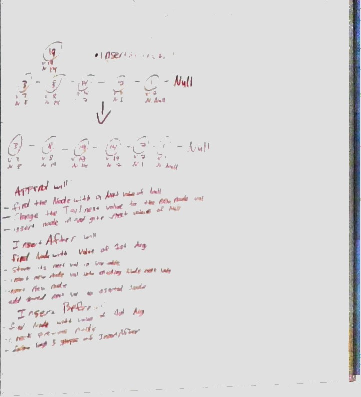
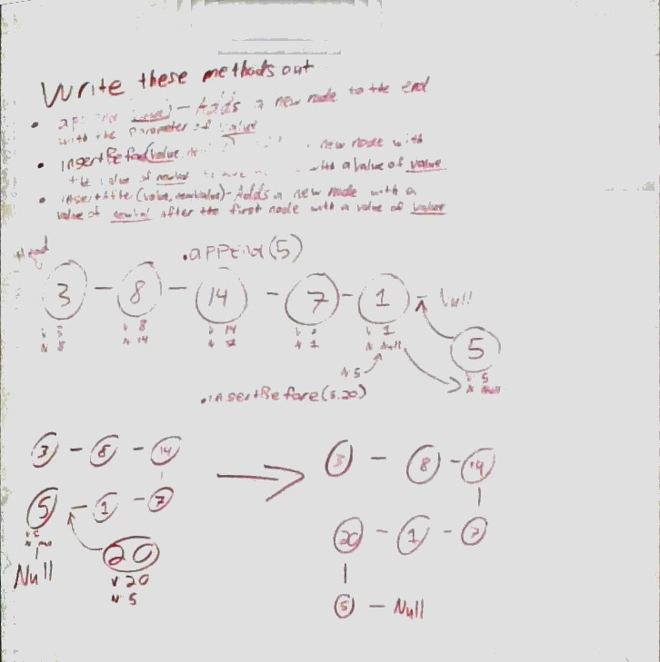
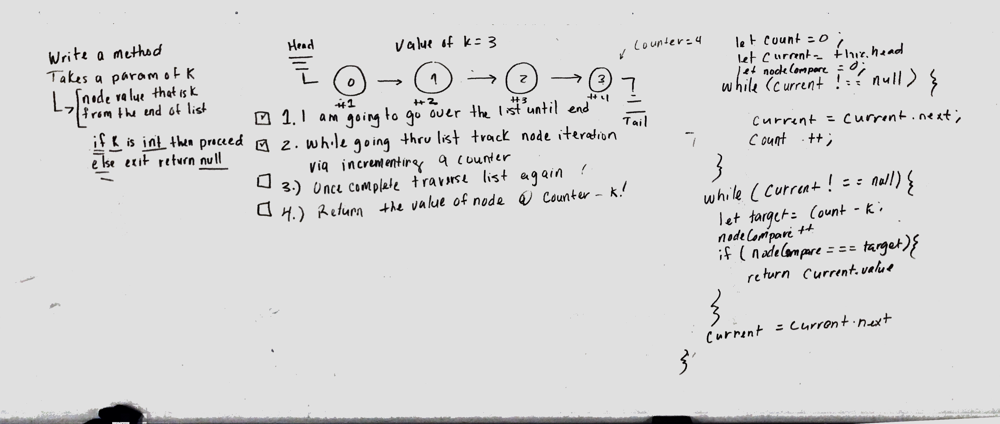
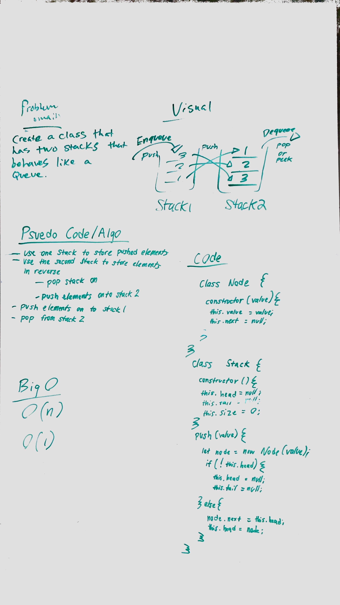
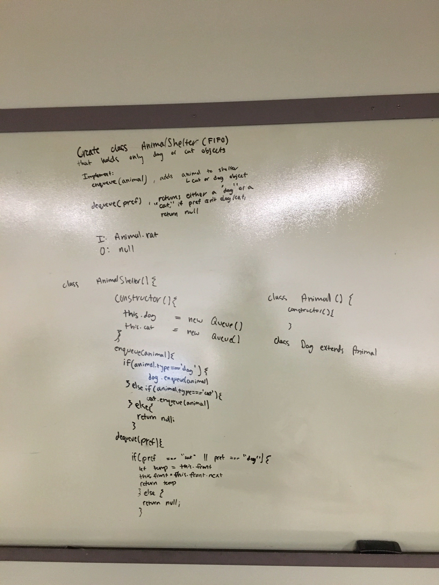

# data-structures-and-algorithms
Javascript 401 Data Structures and Algorithms

# Table of Contents

# Data Structures

# Challenge Summary
Instantiate Linked List

## Challenge Description
<!-- Description of the challenge -->

## Approach & Efficiency
<!-- What approach did you take? Why? What is the Big O space/time for this approach? -->

## Solution
[Singly Linked-List](https://github.com/jeremy-401-advanced-javascript/data-structures-and-algorithms/pull/4)

# Challenge Summary
Number From End

## Challenge Description
<!-- Description of the challenge -->

## Approach & Efficiency
<!-- What approach did you take? Why? What is the Big O space/time for this approach? -->

## Solution
[Linked-List From End](https://github.com/jeremy-401-advanced-javascript/data-structures-and-algorithms/pull/6)

# Challenge Summary
Merge two Linked list

## Challenge Description
<!-- Description of the challenge -->

## Approach & Efficiency
<!-- What approach did you take? Why? What is the Big O space/time for this approach? -->

## Solution
[Merge Linked-List](https://github.com/jeremy-401-advanced-javascript/data-structures-and-algorithms/pull/6)

# Challenge Summary
Stacks and Queues

## Challenge Description
<!-- Description of the challenge -->

## Approach & Efficiency
<!-- What approach did you take? Why? What is the Big O space/time for this approach? -->

## Solution
[Stacks-And-Queues](https://github.com/jeremy-401-advanced-javascript/data-structures-and-algorithms/pull/8)

# Challenge Summary
Queue From Stacks

## Challenge Description
<!-- Description of the challenge -->

## Approach & Efficiency
<!-- What approach did you take? Why? What is the Big O space/time for this approach? -->

## Solution
[Stacks-And-Queues](https://github.com/jeremy-401-advanced-javascript/data-structures-and-algorithms/pull/9)

# Challenge Summary
Fifo Animal Shelter

## Challenge Description
<!-- Description of the challenge -->

## Approach & Efficiency
<!-- What approach did you take? Why? What is the Big O space/time for this approach? -->

## Solution
[Fifo Animal Shelter](https://github.com/jeremy-401-advanced-javascript/data-structures-and-algorithms/pull/12)

