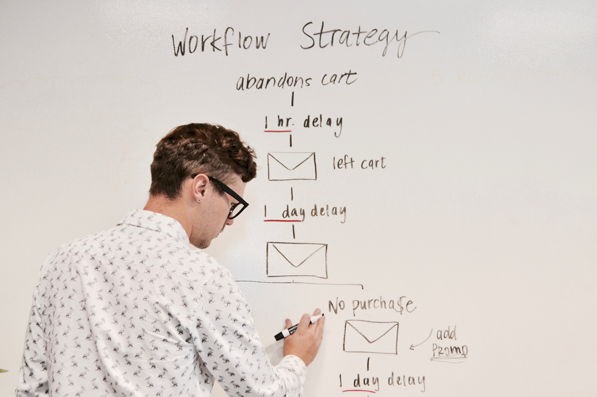

# Challenge 00 

## Reverse An Array

Travis Link -- Test Coverage

### Algorithm

* Reverse the elements of an array by swapping the endpoints and moving them in
* Set a temp to hold one of them
* Move the pointer as we go 
* When they connect - stop (Base Case)

### Whiteboard Photo

